# Task Parse

> Automated Code Assignment Platform — my final year university project for the CS department.

Task Parse is a small web app that lets instructors post coding assignments and lets students submit their code through a built-in editor. Before a submission is actually saved, a custom **parser/checker** looks at the code and tells the student what is missing (required keywords, basic structure, language-specific rules, etc.).


---

## Live Look (Screenshots)

### Landing Page

The home page explains the project in plain words and points new users to either sign up or log in.

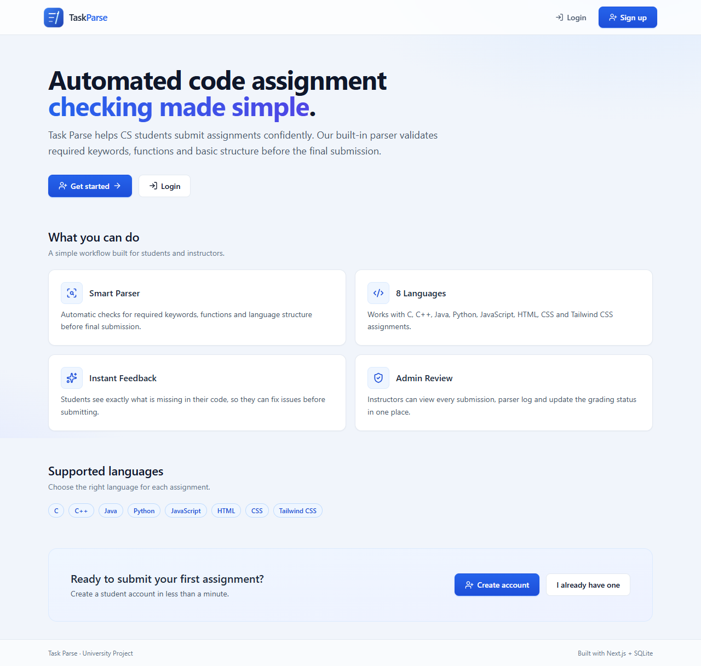

### Login & Sign Up

A simple email/password flow. Demo accounts are listed right on the login card so the examiner can jump straight in.

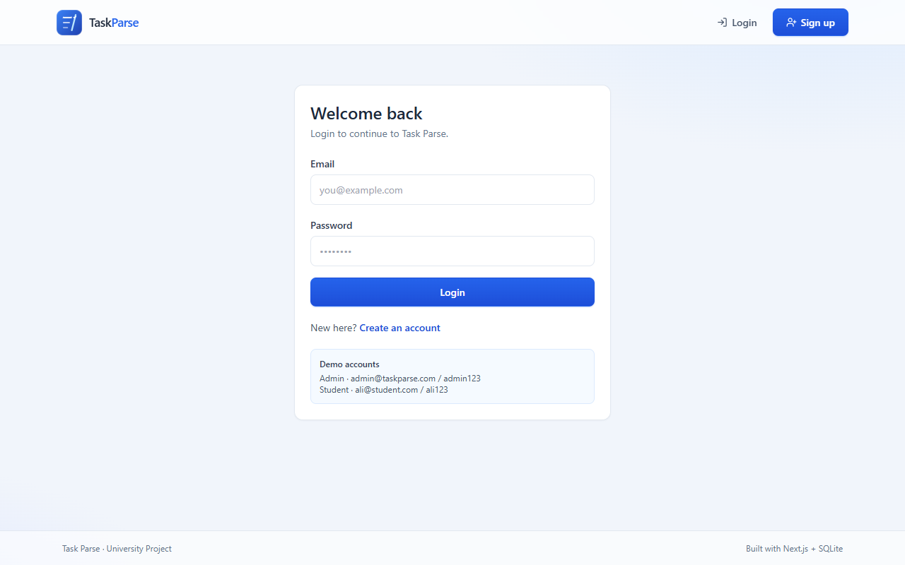

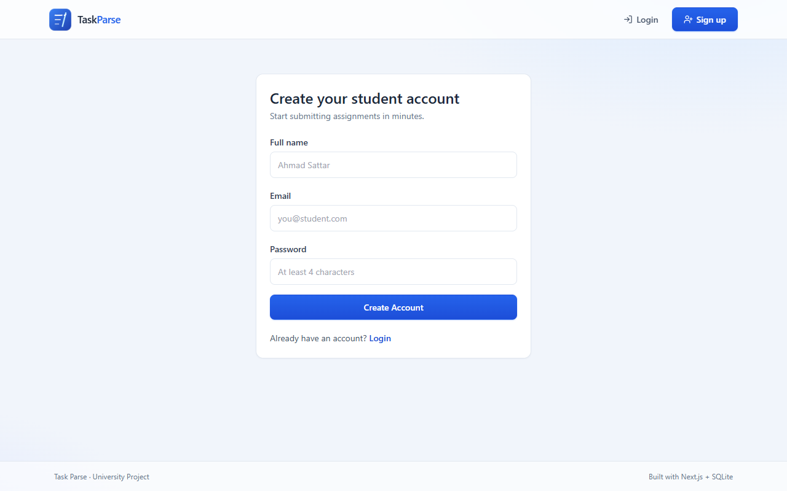

### Student Dashboard

After logging in as a student, you see all available assignments along with two quick stats — total assignments and how many you've already submitted.

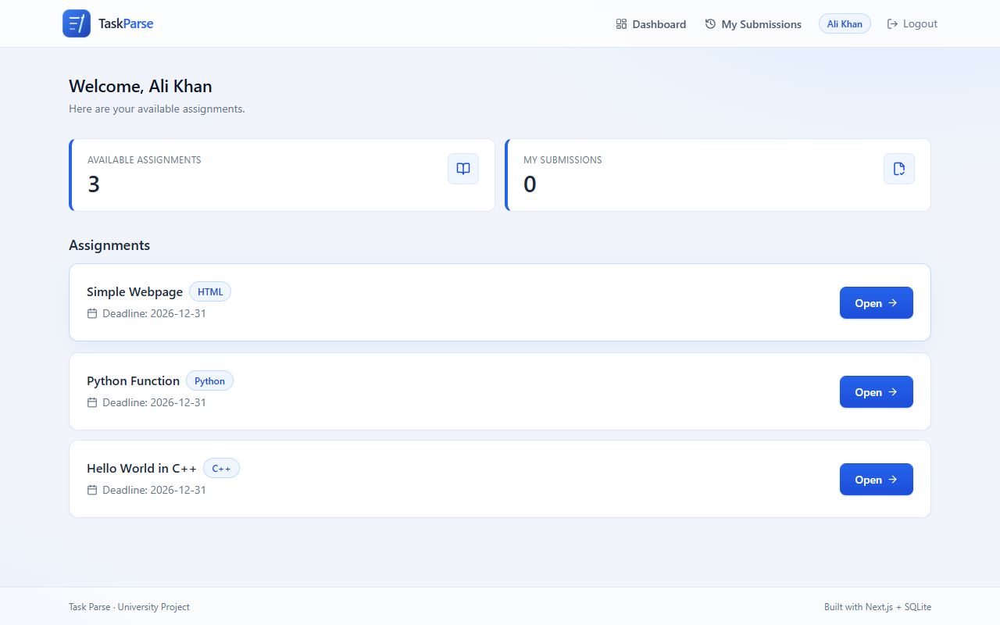

### Assignment Page (Code Editor)

Clicking on an assignment opens the detail page with the description, required keywords and a textarea where the student writes the code.

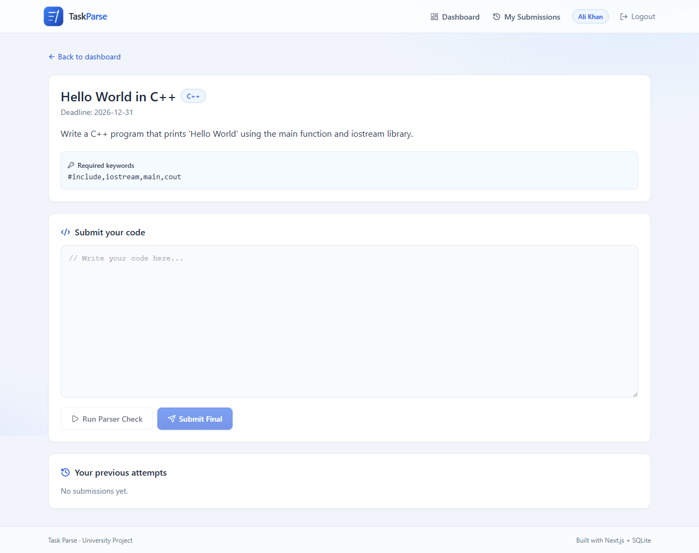

### Parser Result

The "Run Parser Check" button validates the code **without** saving it. The student sees clear messages about what passed or what is still missing, so they can fix things before the final submit.

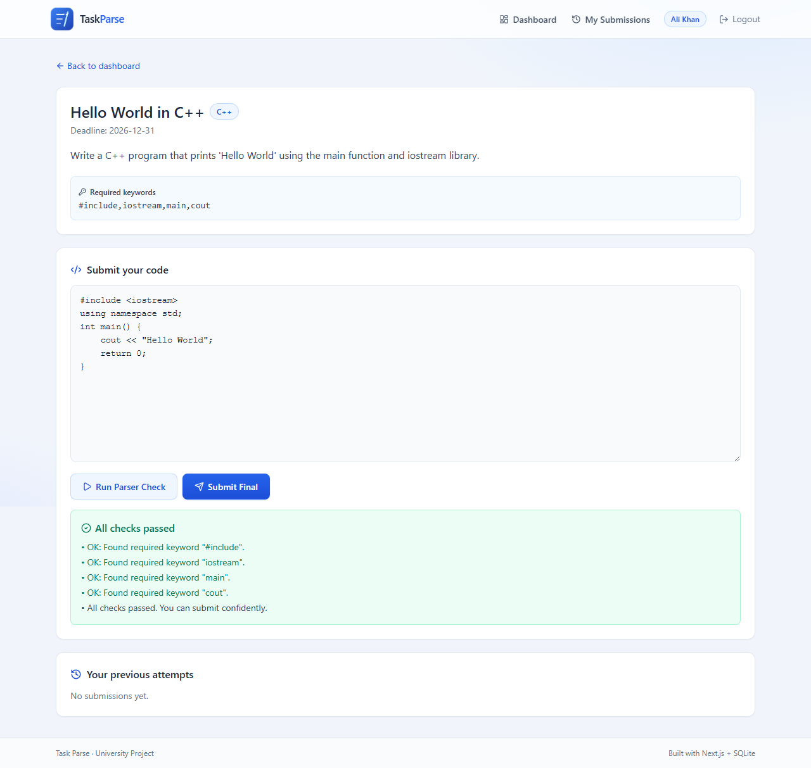

### Submission History

Every final submission is stored, and the student can revisit them any time from the history page.

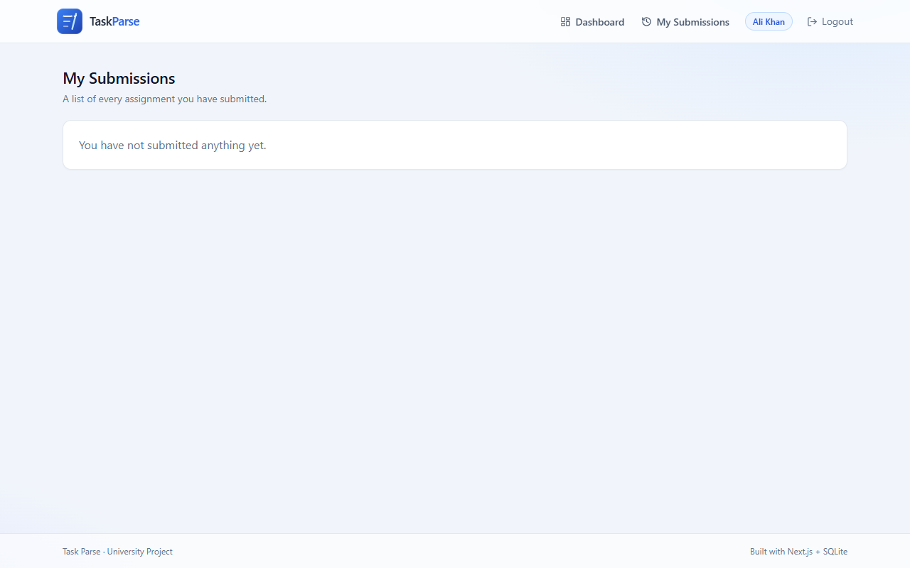

### Admin Dashboard

The admin (instructor) gets a clean overview of how many students, assignments and submissions exist.

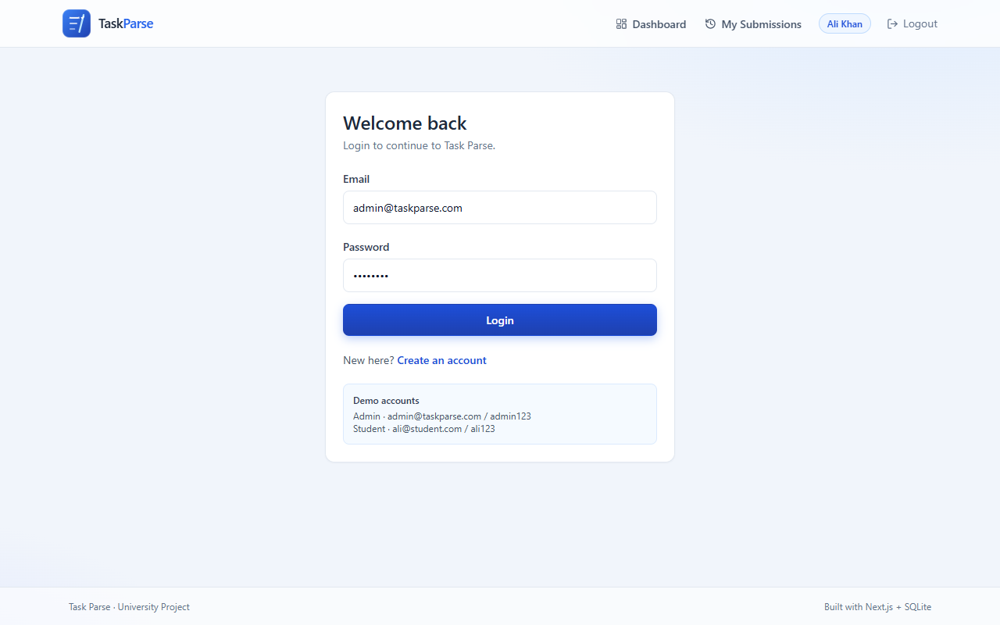

### Manage Assignments

The instructor can see every assignment in one place and delete the ones that are no longer needed.

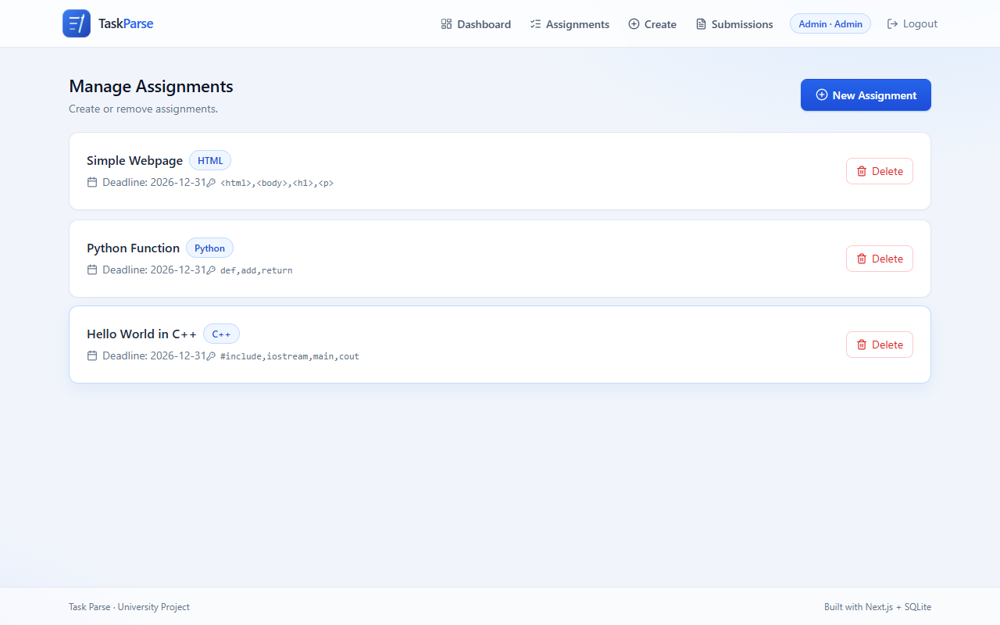

### Create New Assignment

A small form to create an assignment — title, description, language, deadline and the keywords the parser should look for.

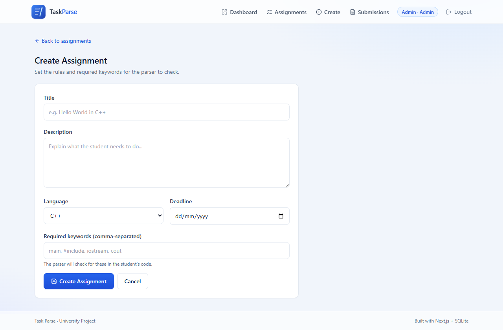

### Submission Detail (Grading)

Opening a submission shows the actual code, the parser log and a small form to update the grading status (passed / needs review / flagged / approved).

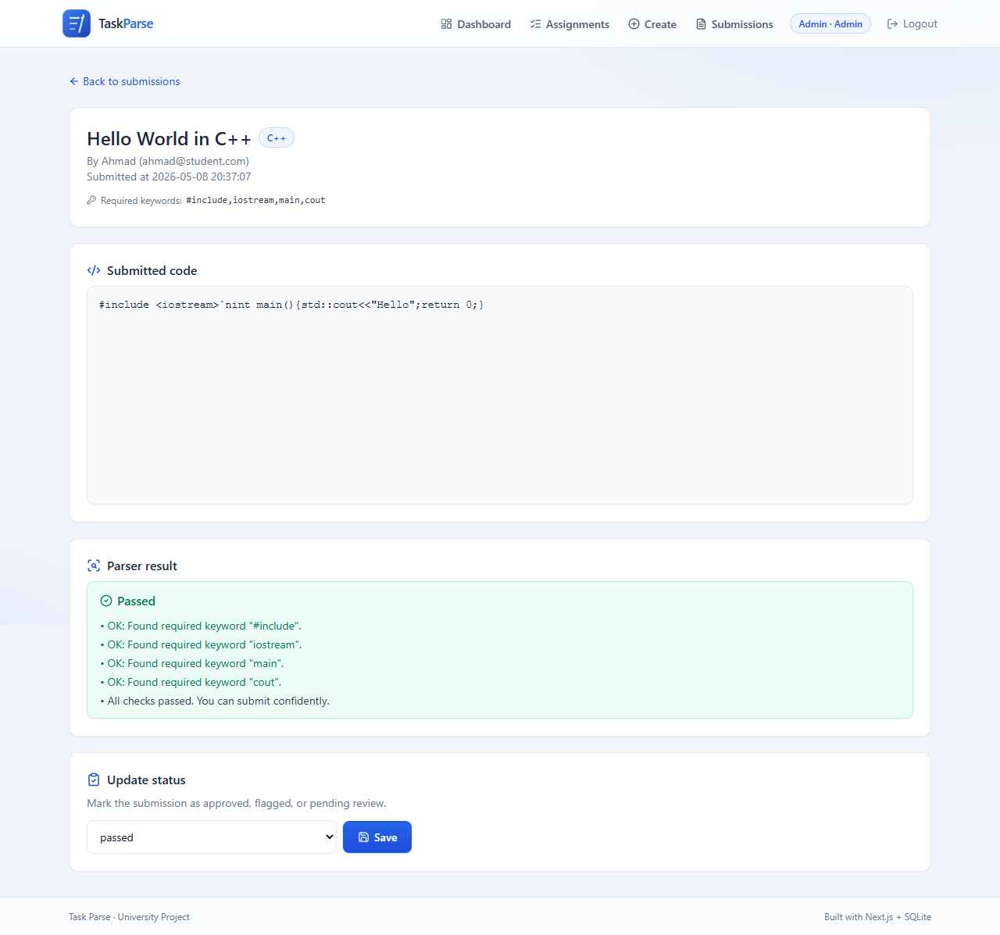

---

## Features

### Student Panel
- Sign up / Login (role: student)
- Dashboard listing all available assignments
- Open an assignment and read its description + required keywords
- Built-in code editor (textarea)
- "Run Parser Check" — test the code without submitting
- "Submit Final" — save the submission and store the parser result
- Submission history page

### Admin / Instructor Panel
- Login (admin role — seeded automatically on first run)
- Dashboard with quick counts
- Create assignments (title, description, language, deadline, required keywords)
- Manage assignments (delete)
- View every student submission
- Open any submission to read the code and parser log
- Update grading status: passed / needs review / flagged / approved

### Supported Languages
C, C++, Java, Python, JavaScript, HTML, CSS, Tailwind CSS

---

## Tech Stack
- **Next.js 14** (App Router) using **JavaScript only** (no TypeScript)
- **React** (comes bundled with Next.js)
- **SQLite** via the `better-sqlite3` package
- **Tailwind CSS** for the UI
- A very small **cookie-based session** (no NextAuth, no JWT)

I picked this stack on purpose — every layer is something I can explain in one sentence.

---

## Getting It Running Locally

> You need **Node.js 18 or higher** installed.

1. Open a terminal inside the project folder.
2. Install the dependencies:

```
npm install
```

3. Start the dev server:

```
npm run dev
```

4. Visit [http://localhost:3000](http://localhost:3000) in your browser.

The SQLite database is created automatically the first time the app boots, inside the `data/` folder (`data/taskparse.db`). No extra setup needed.

### Demo Accounts (created automatically)

| Role    | Email                  | Password  |
|---------|------------------------|-----------|
| Admin   | admin@taskparse.com    | admin123  |
| Student | ahmadsattar@student.com        | ahmad123    |

You can also create your own student account from the **Sign up** page.

---

## Project Structure

I tried to keep the folder layout boring and predictable on purpose.

```
task-parse/
│
├── app/                       # Next.js App Router pages and API routes
│   ├── layout.js              # Root layout (navbar + container)
│   ├── page.js                # Home page
│   ├── globals.css            # Global Tailwind + custom styles
│   │
│   ├── login/page.js          # Login page
│   ├── signup/page.js         # Signup page
│   │
│   ├── student/
│   │   ├── dashboard/page.js          # Student dashboard
│   │   ├── history/page.js            # Submission history
│   │   └── assignments/[id]/page.js   # Assignment + submission page
│   │
│   ├── admin/
│   │   ├── dashboard/page.js              # Admin dashboard
│   │   ├── assignments/page.js            # Manage assignments
│   │   ├── assignments/new/page.js        # Create assignment
│   │   ├── submissions/page.js            # All submissions list
│   │   └── submissions/[id]/page.js       # View one submission
│   │
│   └── api/                                # API routes
│       ├── auth/login/route.js
│       ├── auth/signup/route.js
│       ├── auth/logout/route.js
│       ├── assignments/route.js            # POST create
│       ├── assignments/[id]/route.js       # DELETE
│       ├── submissions/route.js            # POST create submission
│       ├── submissions/[id]/route.js       # PATCH grade status
│       └── parser/check/route.js           # POST run parser only
│
├── components/                # Small reusable React components
│   ├── Navbar.js
│   ├── LogoutButton.js
│   ├── SubmissionForm.js
│   ├── DeleteAssignmentButton.js
│   └── GradeForm.js
│
├── lib/                       # Backend helpers
│   ├── db.js                  # SQLite setup + table creation + seed data
│   ├── auth.js                # Cookie session helpers
│   └── parser.js              # Custom code parser/checker
│
├── data/                      # SQLite database file lives here (auto-created)
├── Documentataion/            # Diagrams, screenshots and the written report
│
├── package.json
├── next.config.js
├── tailwind.config.js
├── postcss.config.js
└── README.md
```

---

## Diagrams

For the report I drew a few UML-ish diagrams. They're saved inside `Documentataion/diagrams/`.

### Use Case Diagram
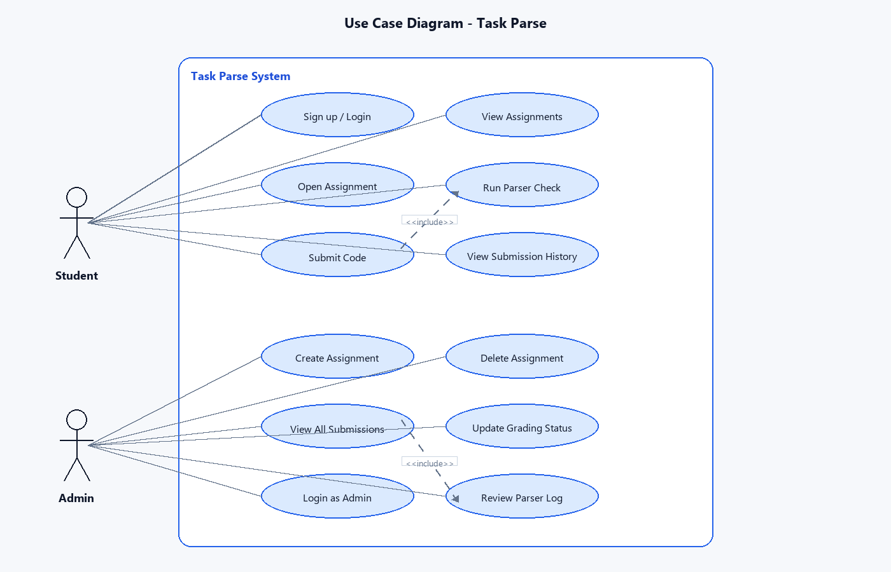

### Class Diagram
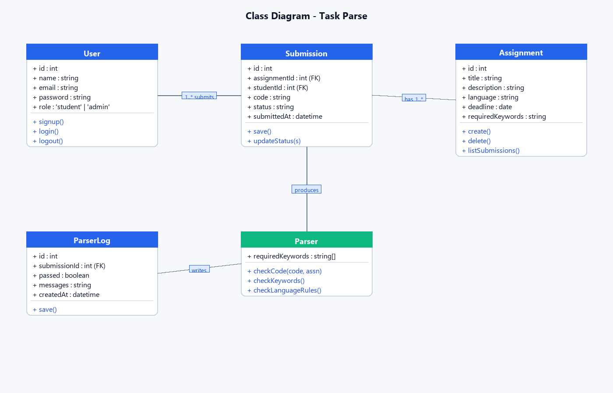

### Activity Diagram
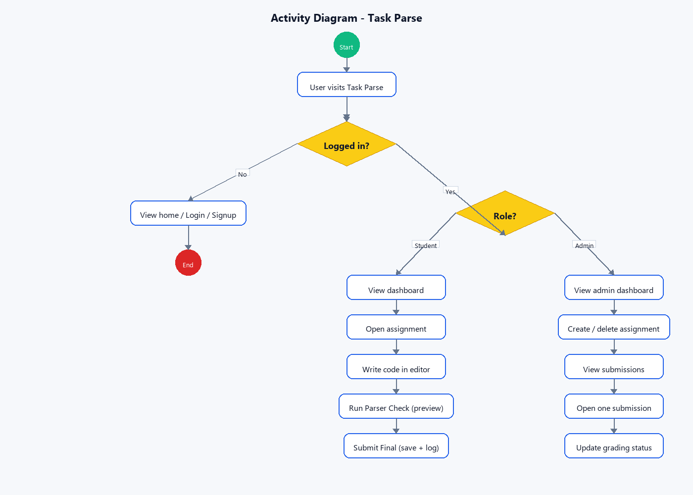

### ER Diagram
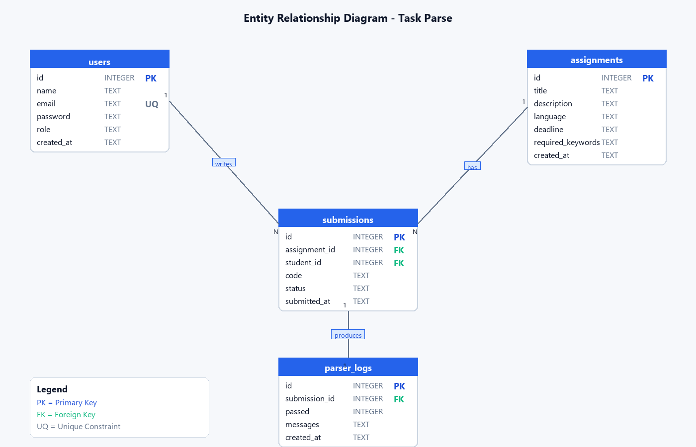

---

## Database (SQLite)

The database file is `data/taskparse.db`. It is created and seeded automatically by `lib/db.js` the first time you run the app.

### Tables

**users**
| column      | type    | notes                              |
|-------------|---------|------------------------------------|
| id          | INTEGER | primary key, auto-increment        |
| name        | TEXT    | full name                          |
| email       | TEXT    | unique                             |
| password    | TEXT    | plain text (kept simple for viva)  |
| role        | TEXT    | 'student' or 'admin'               |
| created_at  | TEXT    | timestamp                          |

**assignments**
| column            | type    | notes                                             |
|-------------------|---------|---------------------------------------------------|
| id                | INTEGER | primary key                                       |
| title             | TEXT    |                                                   |
| description       | TEXT    |                                                   |
| language          | TEXT    | e.g. C++, Python                                  |
| deadline          | TEXT    | YYYY-MM-DD                                        |
| required_keywords | TEXT    | comma-separated keywords used by the parser       |
| created_at        | TEXT    | timestamp                                         |

**submissions**
| column         | type    | notes                                          |
|----------------|---------|------------------------------------------------|
| id             | INTEGER | primary key                                    |
| assignment_id  | INTEGER | foreign key -> assignments.id                  |
| student_id     | INTEGER | foreign key -> users.id                        |
| code           | TEXT    | submitted code                                 |
| status         | TEXT    | submitted / passed / needs review / flagged / approved |
| submitted_at   | TEXT    | timestamp                                      |

**parser_logs**
| column         | type    | notes                                          |
|----------------|---------|------------------------------------------------|
| id             | INTEGER | primary key                                    |
| submission_id  | INTEGER | foreign key -> submissions.id                  |
| passed         | INTEGER | 1 = passed, 0 = failed                         |
| messages       | TEXT    | parser messages joined by newline              |
| created_at     | TEXT    | timestamp                                      |

### Relations (in plain English)
- One **user** (student) can make many **submissions**.
- One **assignment** can have many **submissions**.
- Each **submission** has one **parser_log** (the latest result).

---

## How the Parser Works

The parser lives in `lib/parser.js`. It is a **simple string-based checker** — not a real compiler — which is intentional for a university demo.

Steps the parser performs:

1. **Empty / too short check** — rejects empty or very short code.
2. **Required keywords check** — for every keyword listed in `assignment.required_keywords` (comma-separated), it verifies the keyword appears (case-insensitive) somewhere in the submitted code.
3. **Language-specific structure checks** — small per-language rules:
   - **C / C++**: must contain a `main(` function and at least one `#include`.
   - **Java**: must contain a class declaration and a `public static void main` entry point. If `synchronized` is required, it must be present.
   - **Python**: must contain at least one `def function_name(` definition.
   - **JavaScript**: must contain at least one function (named or arrow).
   - **HTML**: must contain `<html>` and `<body>` tags.
   - **CSS / Tailwind CSS**: must contain `{` and `}` blocks.
4. **Result**: returns `{ passed: true/false, messages: [...] }`. Each message is shown to the student so they know exactly what is missing.

When a final submission happens, the result is also saved into the `parser_logs` table so the admin can review it later.

---

## Important Files (Quick Tour for Viva)

- `lib/db.js` — opens SQLite, creates the tables, seeds the default admin/student/assignments.
- `lib/auth.js` — saves/reads/clears the user id cookie. Returns the logged-in user.
- `lib/parser.js` — the custom code checker (the heart of the project).
- `app/api/auth/*` — login, signup, logout endpoints.
- `app/api/parser/check/route.js` — runs the parser without saving anything.
- `app/api/submissions/route.js` — saves a final submission + the parser log.
- `app/api/assignments/*` — create / delete assignments.
- `app/student/*` — student-facing pages.
- `app/admin/*` — admin-facing pages.
- `components/SubmissionForm.js` — the textarea + the run/submit buttons.

---

## Author

Built by **Ahmad Sattar** as a Web App Development Course Semester Project.
